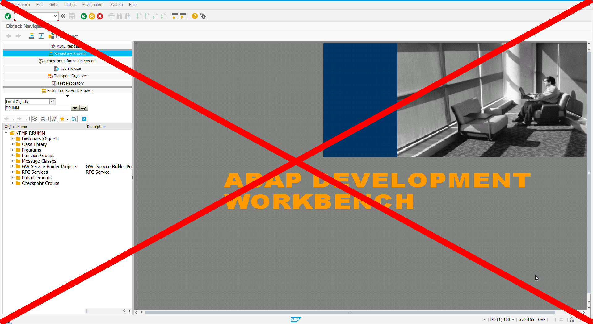

# Agenda
1. [Disclaimer](#/2)
1. [Introduction](#/3)
1. [CF Service on HCP](#/4)
1. [Demo](#/6)

# Disclaimer
This talk is **not** about running **ABAP** on HCP 

Sorry

# Introduction
* Lots of announcements around SAPPHIRE NOW
* One announcement did not get a lot of attention

> Cloud Foundry services are available as beta on SAP HANA Cloud Platform

# CF Services on HCP
Planned SAP HCP architeture 

## CF Services available in the Beta
* Clound Foundry build packs
  * Java
  * Node.js
  * Go
  * PHP
  * ...
* Services available trough marketplace
  * Redis
  * RabbitMQ
  * MongoDB
  * PostgreSQL

# Demo
<!-- .slide: data-background="images/demo.png" -->
Demo

